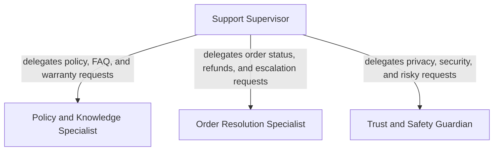

# Retail Support Multi-Agent System

A production-leaning LangChain repository that models a retail customer-support operation with multiple collaborating agents.

## What the system does

The application exposes four cooperating roles:
- **Support Supervisor**
- **Policy and Knowledge Specialist**
- **Order Resolution Specialist**
- **Trust and Safety Guardian**

The supervisor routes customer requests to the most appropriate specialist and can combine multiple specialist answers before returning a final response.

## Architecture diagram



This view focuses only on the available agents and their delegation relationships inside the multi-agent system implemented by [`RetailSupportOrchestrator`](retail_support/runtime.py:41).

## Repository structure

- [`main.py`](main.py) — CLI entrypoint
- [`chainlit_app.py`](chainlit_app.py) — Chainlit web interface
- [`retail_support/__init__.py`](retail_support/__init__.py) — package exports
- [`retail_support/config.py`](retail_support/config.py) — environment-driven configuration
- [`retail_support/data.py`](retail_support/data.py) — in-memory seed data
- [`retail_support/services.py`](retail_support/services.py) — retail support business operations
- [`retail_support/runtime.py`](retail_support/runtime.py) — multi-agent orchestration and session handling
- [`retail_support/app.py`](retail_support/app.py) — CLI application logic
- [`retail_support/stage1_eval.py`](retail_support/stage1_eval.py) — Stage 1 evaluation harness for DeepEval, Ragas, and MLflow
- [`tests/test_stage1_deepeval.py`](tests/test_stage1_deepeval.py) — pytest/DeepEval regression checks for Stage 1
- [`reports/stage1-evaluation-report.md`](reports/stage1-evaluation-report.md) — generated Stage 1 markdown report

## Requirements

- Python 3.10+
- either OpenAI or Azure OpenAI credentials

Install dependencies:

```bash
pip install -r requirements.txt
```

## Configuration

The runtime supports both standard OpenAI and Azure OpenAI.

### OpenAI configuration

```bash
set LLM_PROVIDER=openai
set OPENAI_API_KEY=your_key_here
set OPENAI_MODEL=gpt-4.1-mini
```

### Azure OpenAI configuration

```bash
set LLM_PROVIDER=azure
set AZURE_OPENAI_API_KEY=your_azure_key_here
set AZURE_OPENAI_ENDPOINT=https://your-resource-name.openai.azure.com/
set AZURE_OPENAI_API_VERSION=2024-02-01
set AZURE_OPENAI_DEPLOYMENT=your-deployment-name
```

Notes:
- [`LLM_PROVIDER`](retail_support/config.py:25) defaults to `openai`.
- When using Azure, [`AZURE_OPENAI_DEPLOYMENT`](retail_support/config.py:32) is the deployment name configured in Azure OpenAI, not the raw model family name.
- The provider selection and validation are implemented in [`SupportSettings.from_env()`](retail_support/config.py:23).
- Model client creation is handled in [`RetailSupportOrchestrator._build_model()`](retail_support/runtime.py:84).

Optional runtime tuning:

```bash
set OPENAI_TEMPERATURE=0
set OPENAI_TIMEOUT_SECONDS=60
set OPENAI_MAX_RETRIES=2
```

## Run the CLI

Start an interactive supervisor session:

```bash
python main.py --interactive
```

Send a single message:

```bash
python main.py --message "I am user_001, check order ord_1001"
```

Talk directly to a subsystem:

```bash
python main.py --agent orders --message "Check order ord_2001 and tell me if it can be escalated"
```

In interactive mode, switch agents with:

```text
/agent supervisor
/agent knowledge
/agent orders
/agent safety
```

## Run the Chainlit app

```bash
chainlit run chainlit_app.py
```

Inside the UI you can switch the active subsystem with the same `/agent ...` commands.

## Stage 1 evaluation stack

The repository now includes a Stage 1 evaluation workflow aligned to the development-testing architecture:
- [`DeepEval`](tests/test_stage1_deepeval.py) for pytest-native regression checks
- [`Ragas`](retail_support/stage1_eval.py) for synthetic dataset generation from the in-repo knowledge base
- [`MLflow`](retail_support/stage1_eval.py) for experiment tracking and artifact logging

Install the Stage 1 dependencies:

```bash
pip install -r requirements.txt
```

Run the curated DeepEval suite:

```bash
pytest tests/test_stage1_deepeval.py -q
```

Run the full Stage 1 workflow with report generation:

```bash
python -m retail_support.stage1_eval
```

Generated artifacts:
- [`artifacts/stage1/stage1_curated_results.json`](artifacts/stage1/stage1_curated_results.json)
- [`artifacts/stage1/ragas_synthetic_dataset.json`](artifacts/stage1/ragas_synthetic_dataset.json)
- [`reports/stage1-evaluation-report.md`](reports/stage1-evaluation-report.md)
- [`mlruns/`](mlruns/)

## Production-like characteristics

This repository is intentionally structured like an application instead of a notebook demo:
- configuration is externalized in [`SupportSettings`](retail_support/config.py:12)
- orchestration is isolated in [`RetailSupportOrchestrator`](retail_support/runtime.py:41)
- business logic is separated into [`SupportOperationsService`](retail_support/services.py:12)
- session state is explicit through [`SupportSession`](retail_support/runtime.py:27)
- the Chainlit UI is separated from the runtime layer
- provider-specific model initialization is isolated from business workflows

## Notes

The current implementation uses in-memory seed data for orders, support knowledge, and policy rules so the repository stays self-contained. The architecture is ready to be evolved toward real repositories, APIs, persistent ticketing, and external observability.
